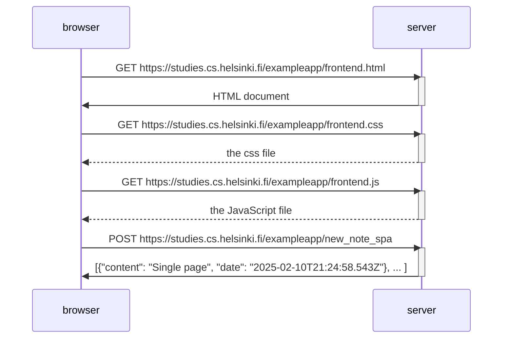

```mermaid
sequenceDiagram
participant browser
participant server

browser->>server: GET https://studies.cs.helsinki.fi/exampleapp/frontend.html
activate server
server->>browser:HTML document
deactivate server

browser->>server: GET https://studies.cs.helsinki.fi/exampleapp/frontend.css
activate server
server-->>browser: the css file
deactivate server

browser->>server: GET https://studies.cs.helsinki.fi/exampleapp/frontend.js
activate server
server-->>browser: the JavaScript file
deactivate server

browser->>server: POST https://studies.cs.helsinki.fi/exampleapp/new_note_spa
activate server
server->>browser: [{"content": "Single page", "date": "2025-02-10T21:24:58.543Z"}, ... ]
deactivate server

```
